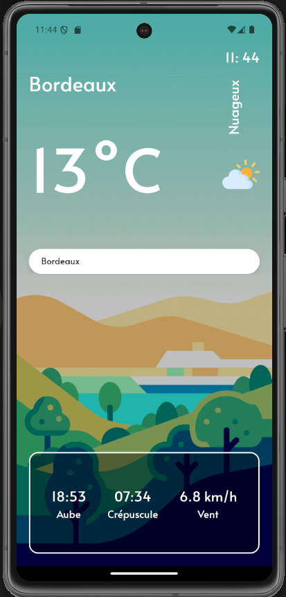
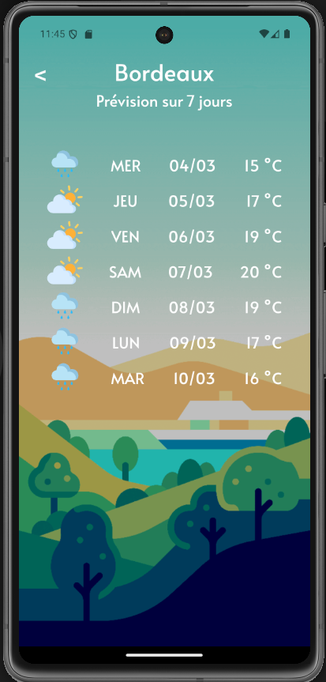

# MeteoNow

This is a `React Native` application that allows users to get weather information for any location. It is powered by various modern technologies including `React Navigation` for routing, `Axios` for API requests, and `Expo` for development and build tools.

## Features

- **Weather Search**: Search for weather information using a dynamic search input that fetches results from a weather API.
- **Weather Overview**: Displays an overview of the current weather conditions.
- **Detailed Weather Cards**: Shows detailed information about the weather in a card format.
- **Location-Based Weather**: Provides weather information based on the user's current location.
- **7-Day Forecast**: View a detailed 7-day weather forecast.
- **Real-Time Clock**: Displays the current time dynamically.
- **Advanced Weather Details**: Shows additional weather details such as wind speed, sunrise, and sunset times.

## Screenshots

Here are some screenshots of the application:






## Installation

1. **Clone the repository**:

```bash
git clone https://github.com/your-repository/meteo-now.git
```

2. **Install dependencies**:

```bash
npm install
```

3. **Run the development server**:

```bash
npm start
```

## Technologies Used

- 
- 
- 
- 
